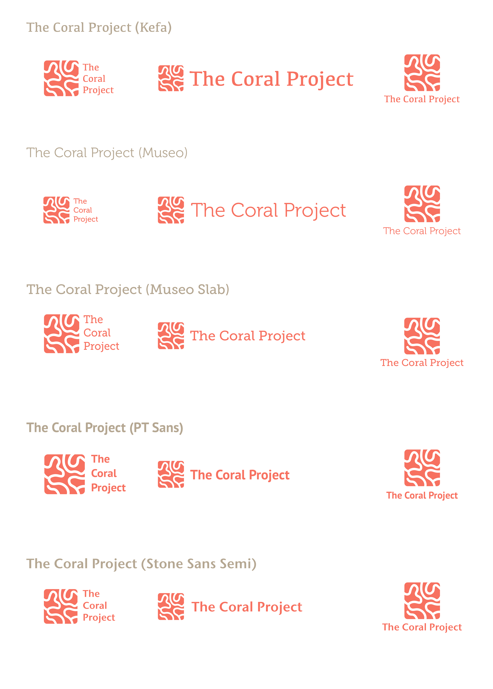
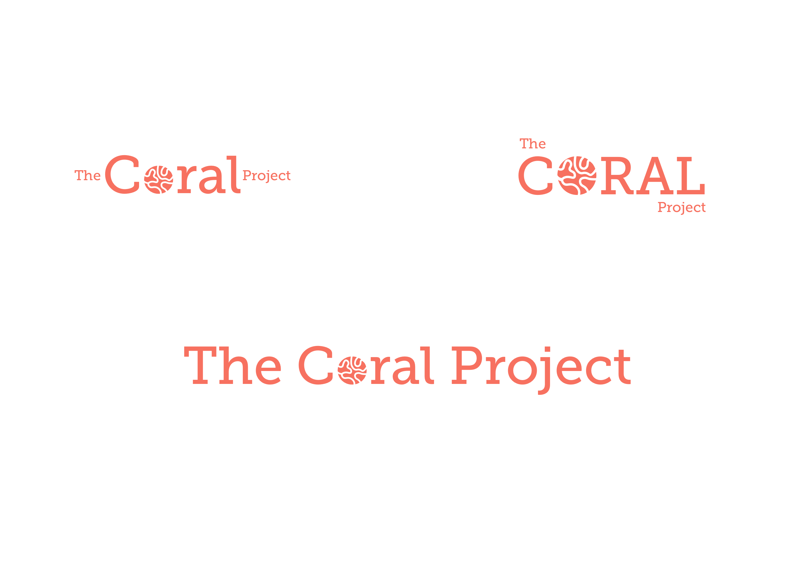
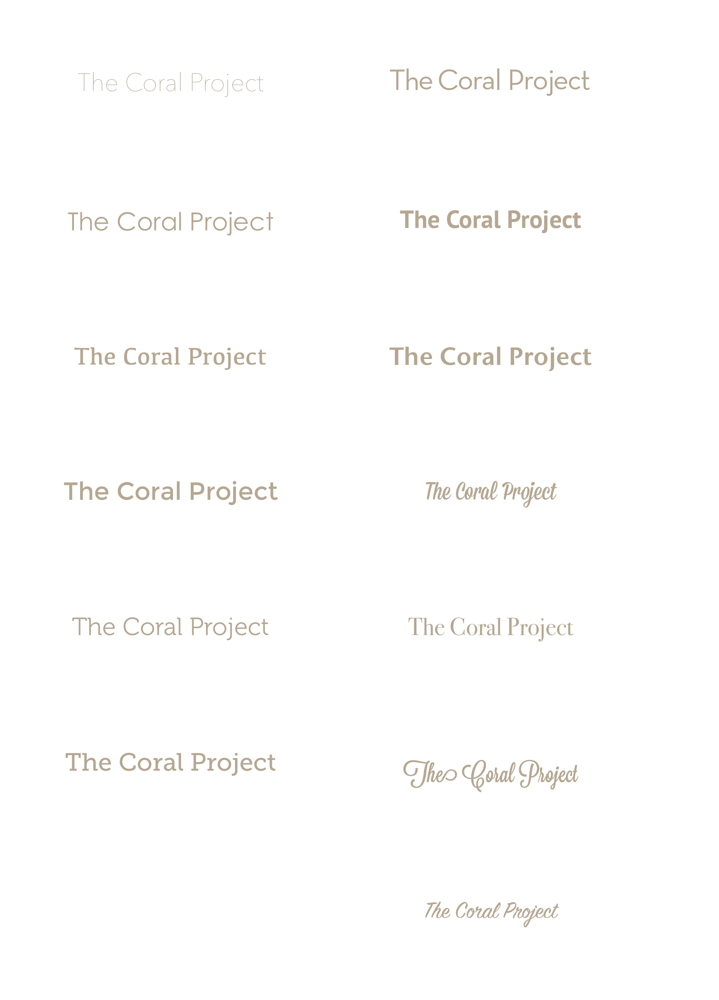

## Brand & Identity

### Logo

Logo iterations around brain coral pattern.

___

#### Mark

Logo mark exploration.

___
Word mark exploration

___
Word mark exploration around Museo Slab

___

### Color

Final color palette loosely based on coral motifs.

___

### Typography

Final family selection ended up being Museo, but we are making the switch over to Josefin Slab for titles.

___

### Styleguide

TODO: build out simple, drill down or other structure or clone one like edx, atom, or docter.

#### Assets

TODO: add ppt/key templates, sketch/ai/psd files.
