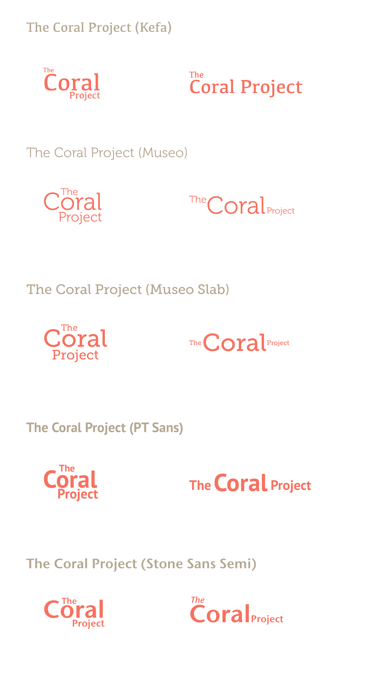

## Brand & Identity

### Logo

#### Mark

### Color

### Typography

### Styleguide

TODO: build out simple, drill down or other structure or clone one like edx, atom, or docter. 

#### Assets

TODO: add ppt/key templates, sketch/ai/psd files.
