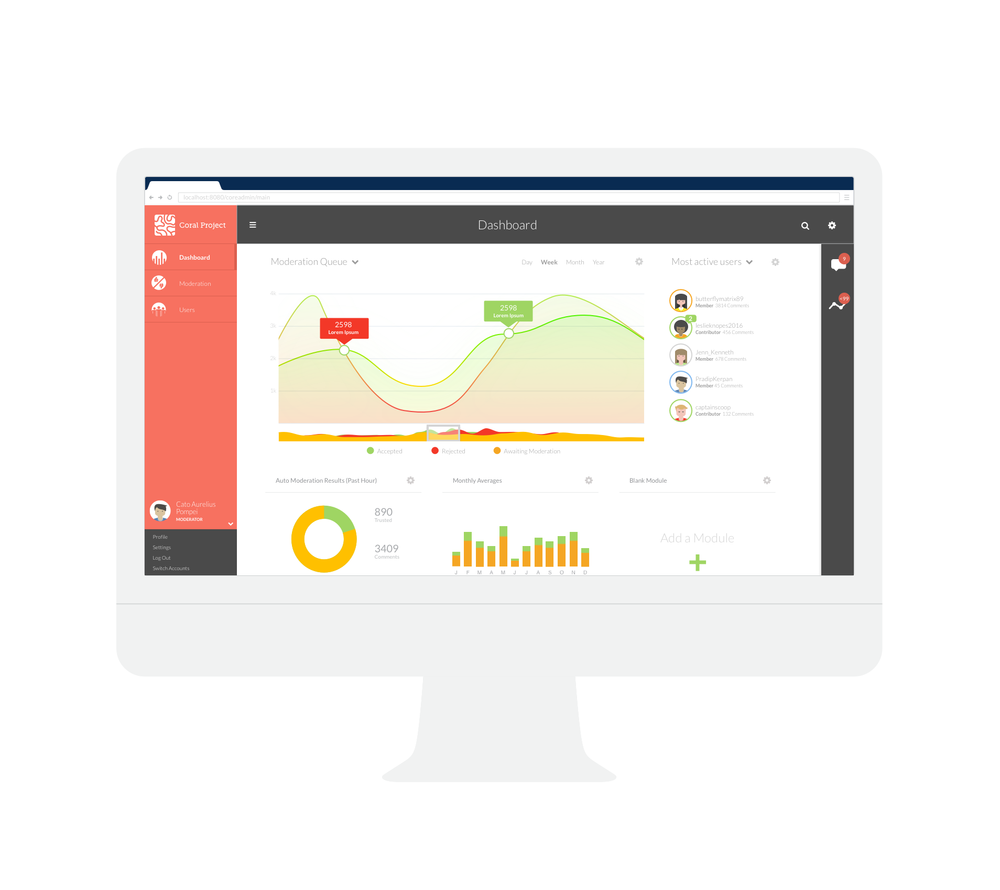
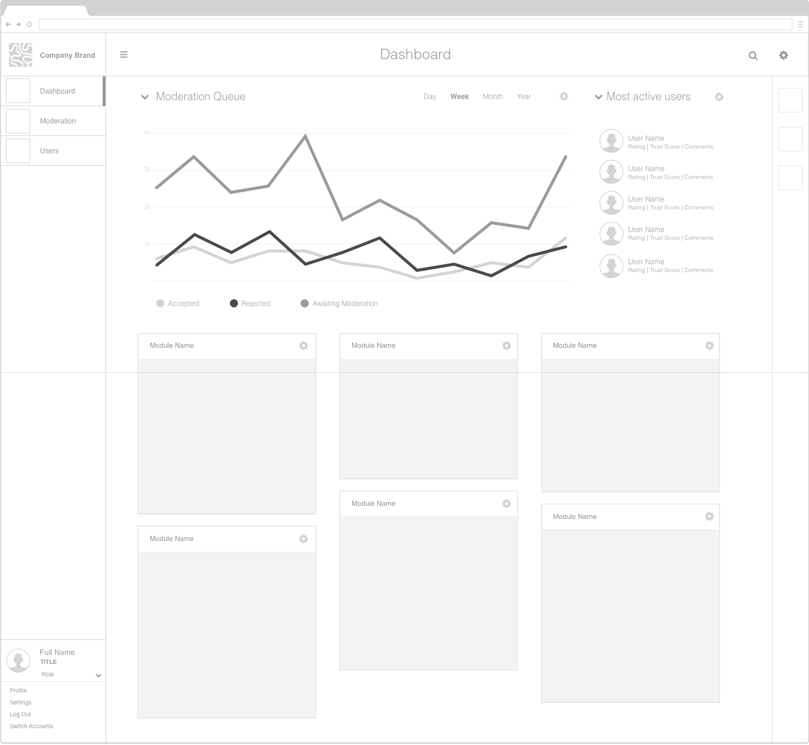
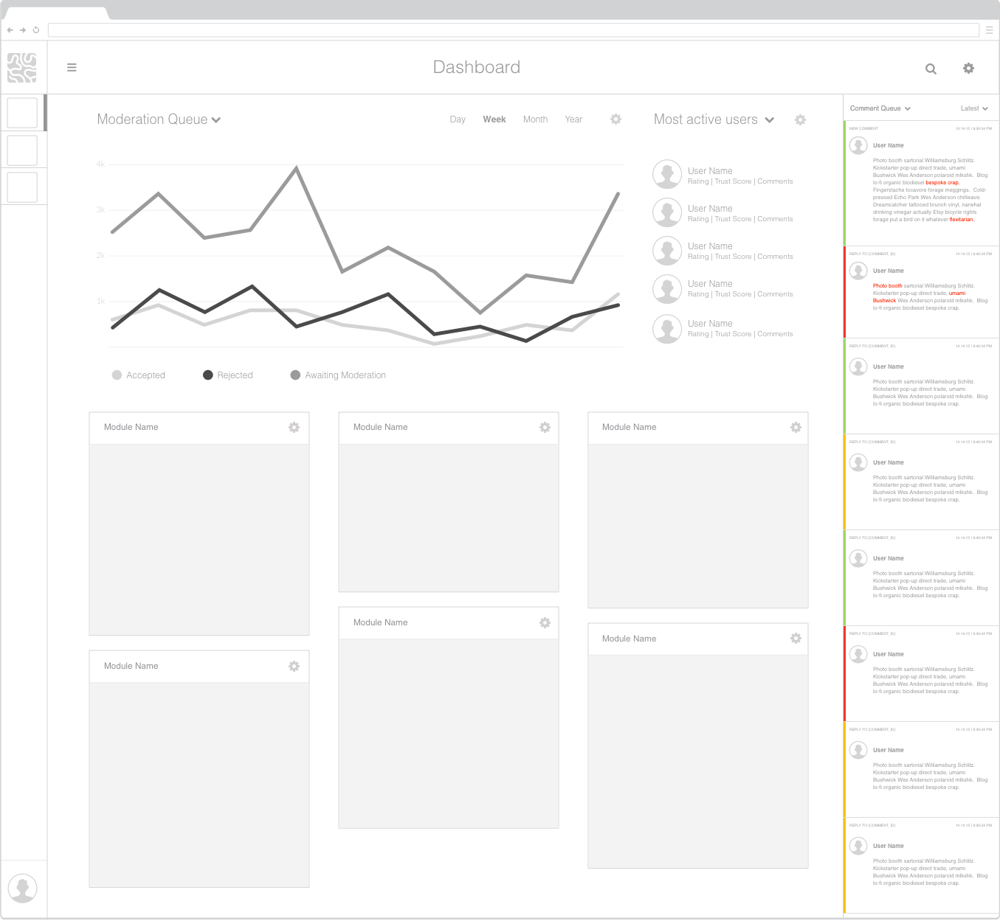
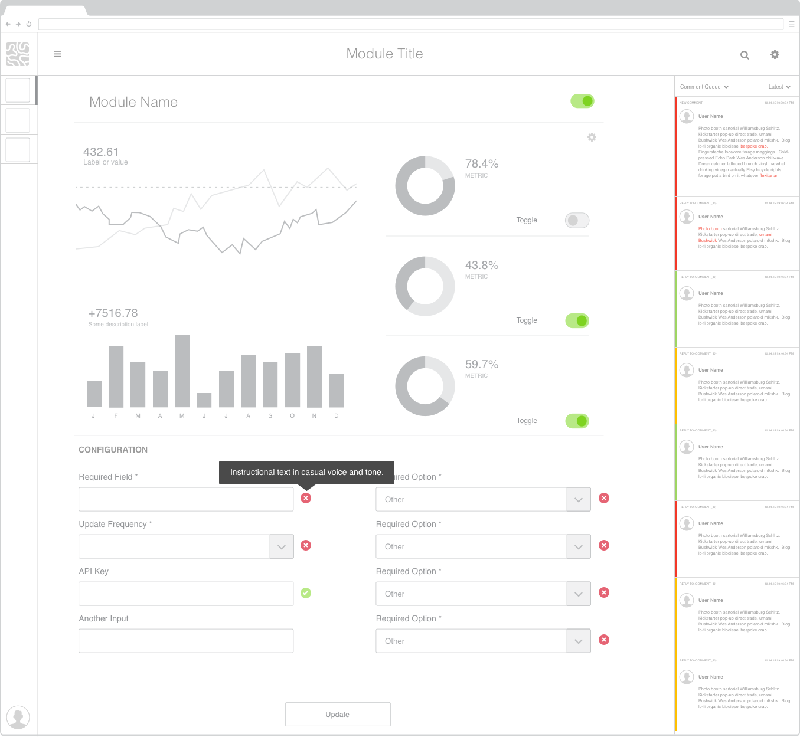
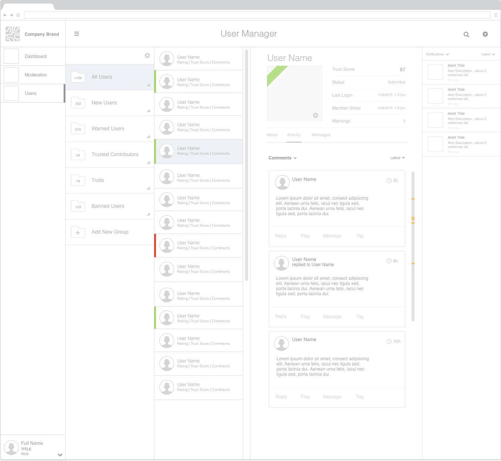
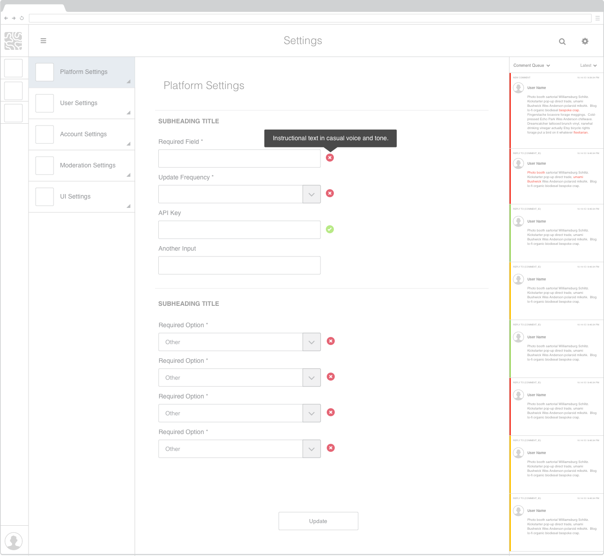
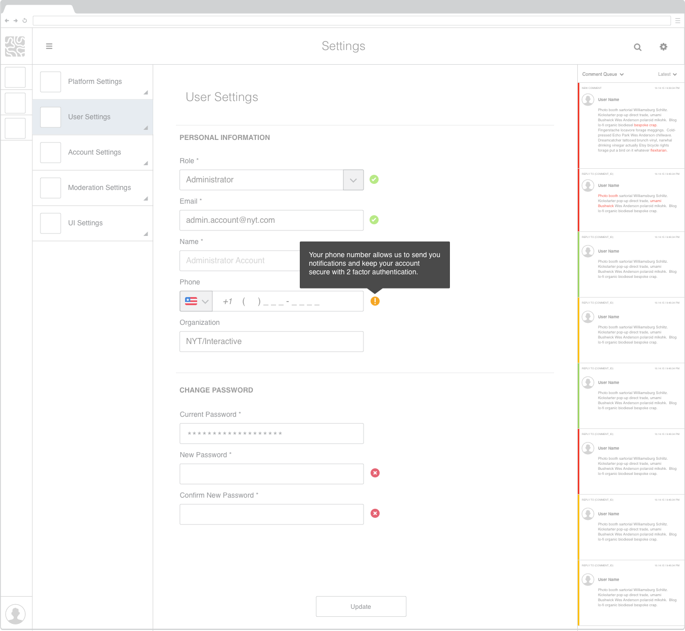

### 1.1.0

#### Dashboard List Driven UI Mockup

#### Wireframes

##### List driven UI

 1.  Dashboard side panel closed

 

 2. Dashboard side panel open

 

 3. Module Detail View / Options

 

 4. User manager profile

    - H1 User Manager Profile  

      

    - H2 User Manager Profile

      

 5. Settings

    - Platform

      

    - User

        
