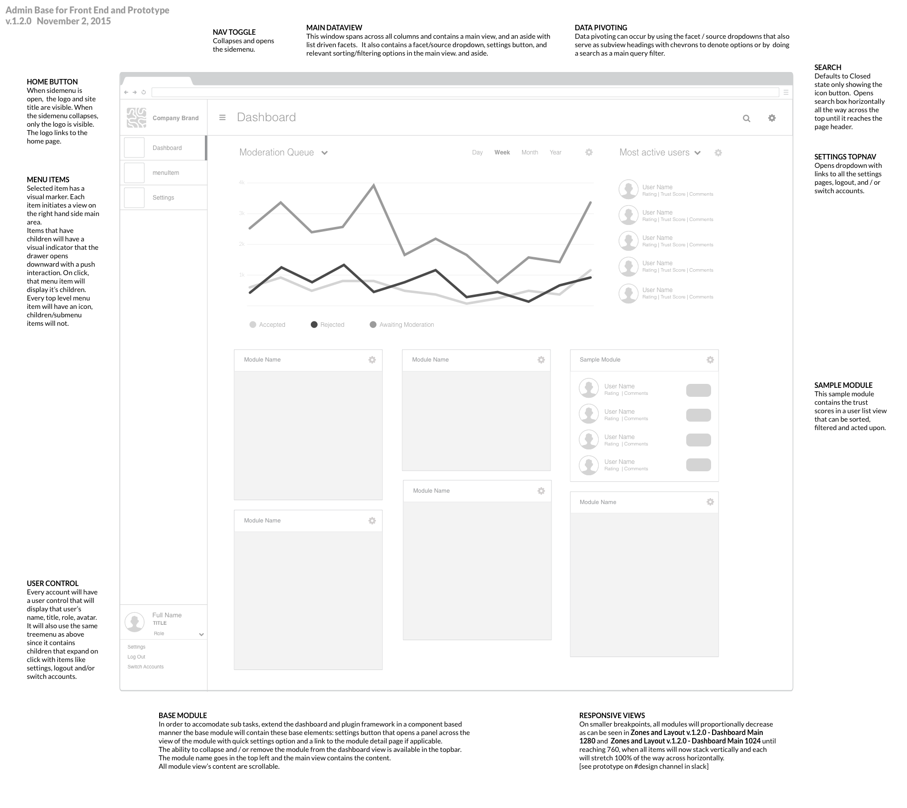
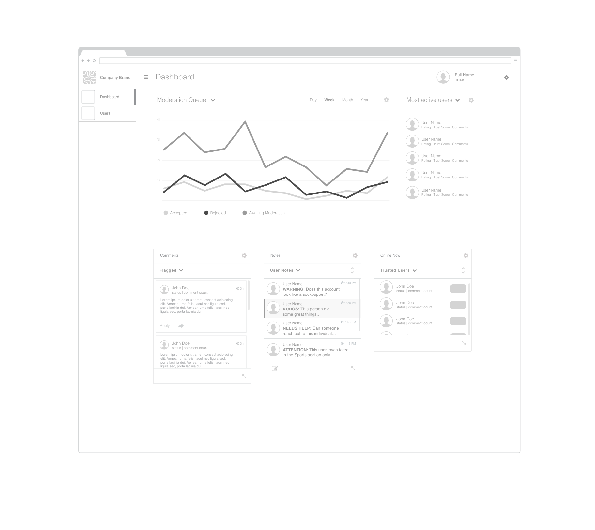
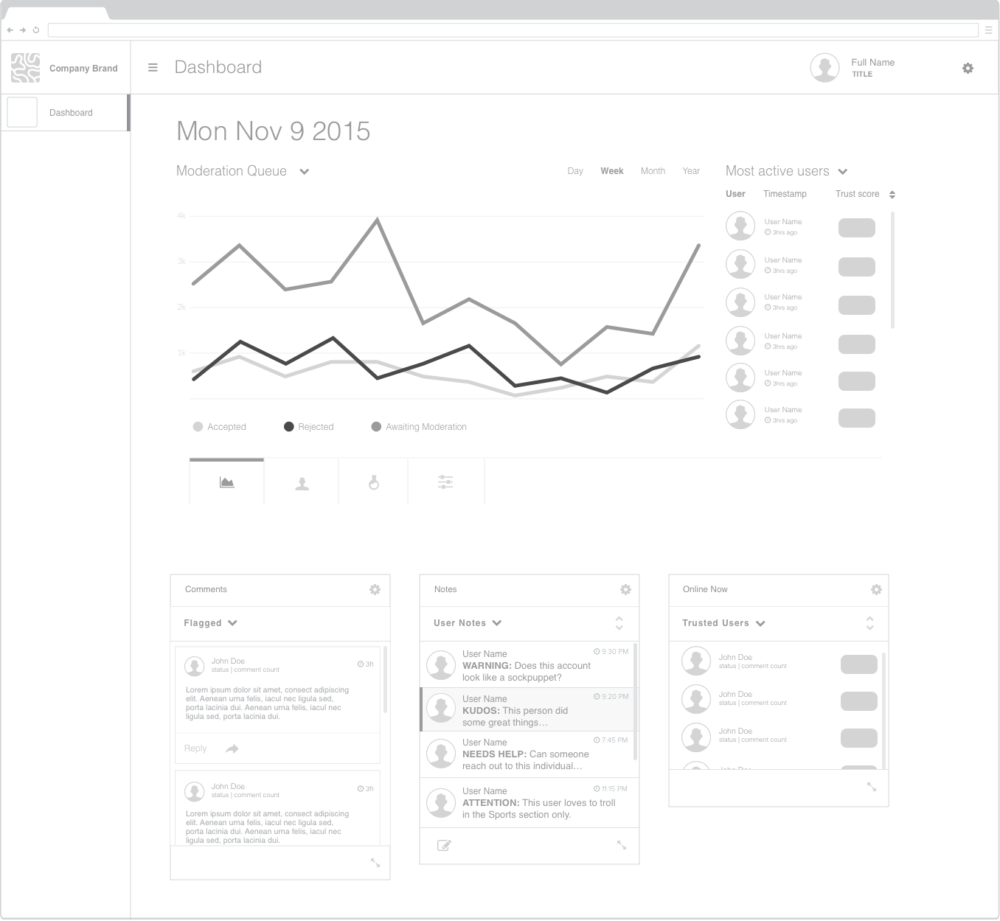
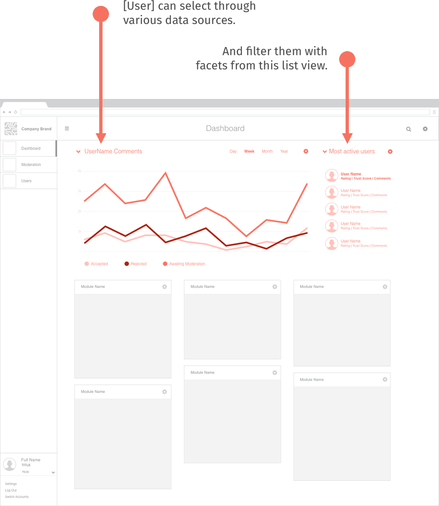
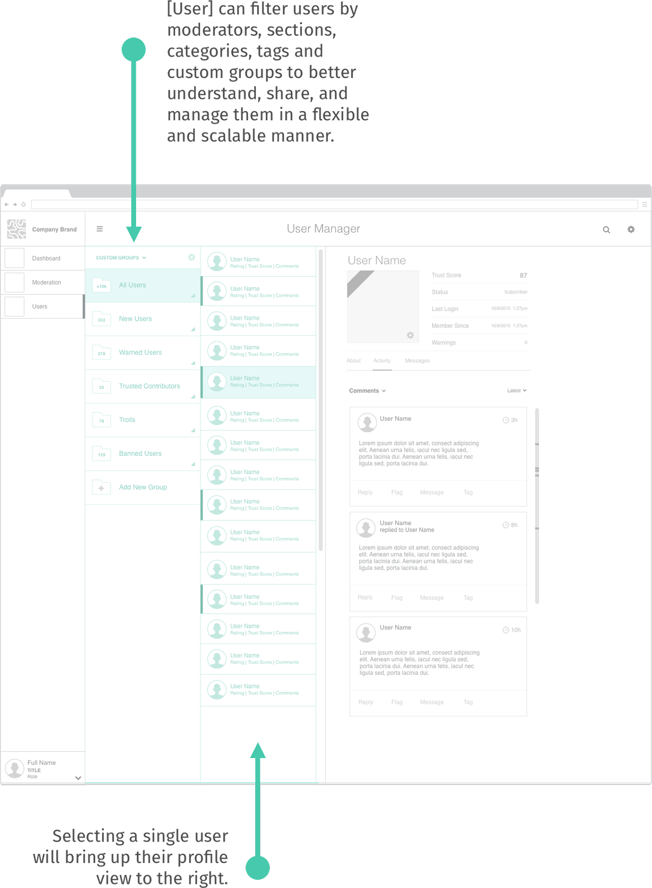
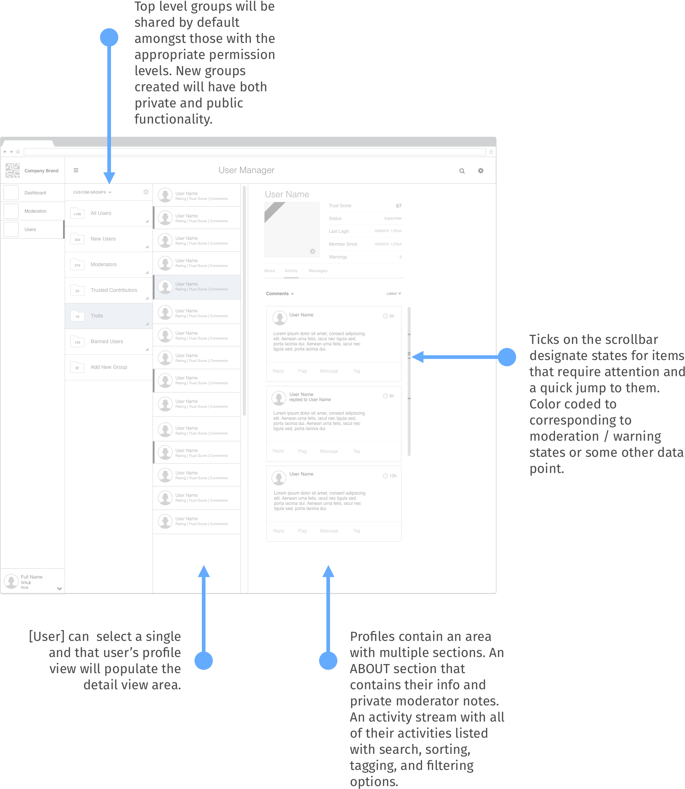
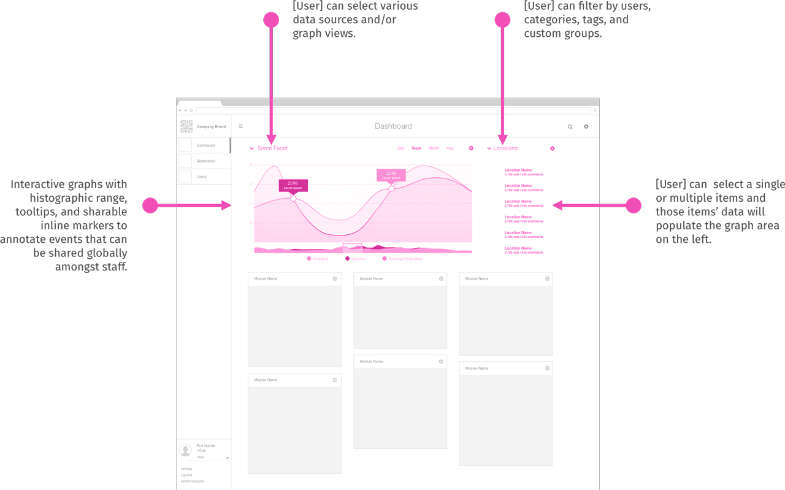
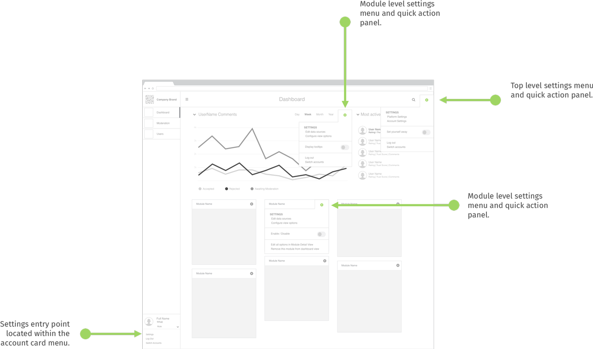

### 1.2.0

#### Wireframes

##### Dashboard

 1. List driven UI - Annotated wireframe

##### Dashboard

Alternatives with repositioned user card in the top right and the user manager as a tab in the data rather than its own page.

 1. List driven UI alternative

 
 2. Search driven UI alternative

 

#### User Stories

The stories below are derived from needs analysis of interviews conducted with news staffs of all types over the past year. Coupling our features and flows with that of each role will help us to stay focused on their explicit needs.

##### *As an Engagement Editor*

 -  I need analytics to be able to track people on site, retention, etc in order to calculate lifetime value of each reader. This is because it helps with the business calculations / advertising / proving and quantifying the value of community.

     

 -  I need to have a sense of who is in a particular section's community so the publication can do a better job of identifying gaps in their coverage in order to serve the community better.

     

 -  I need to have tools to pass on knowledge about active trolls, top commenters, etc within the system. This is so that user behavior can be understood in context, and institutional knowledge isn't lost if someone leaves.

     

 -  I need a demographic/other data point breakdown to understand if good/bad behavior correlates to anything - eg time of day, language used, etc. to help allocate future moderation resources.

     

 -  I need a way to configure, customize and extend each tool.    

     
