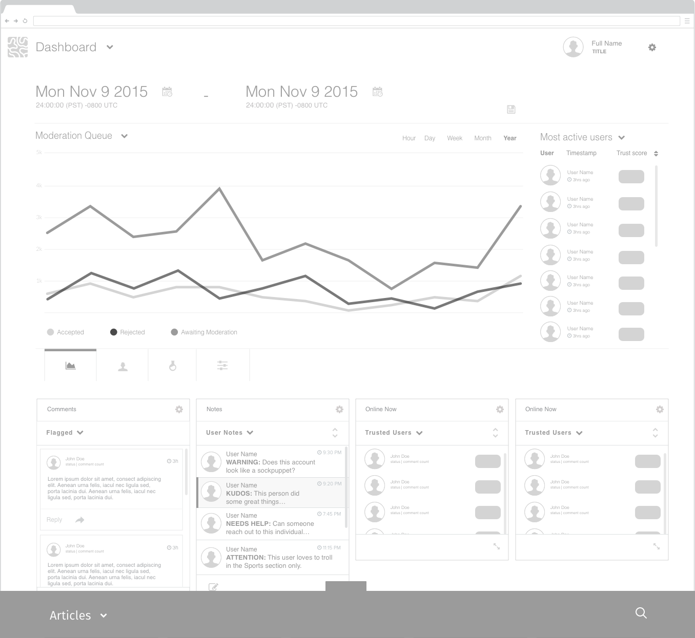
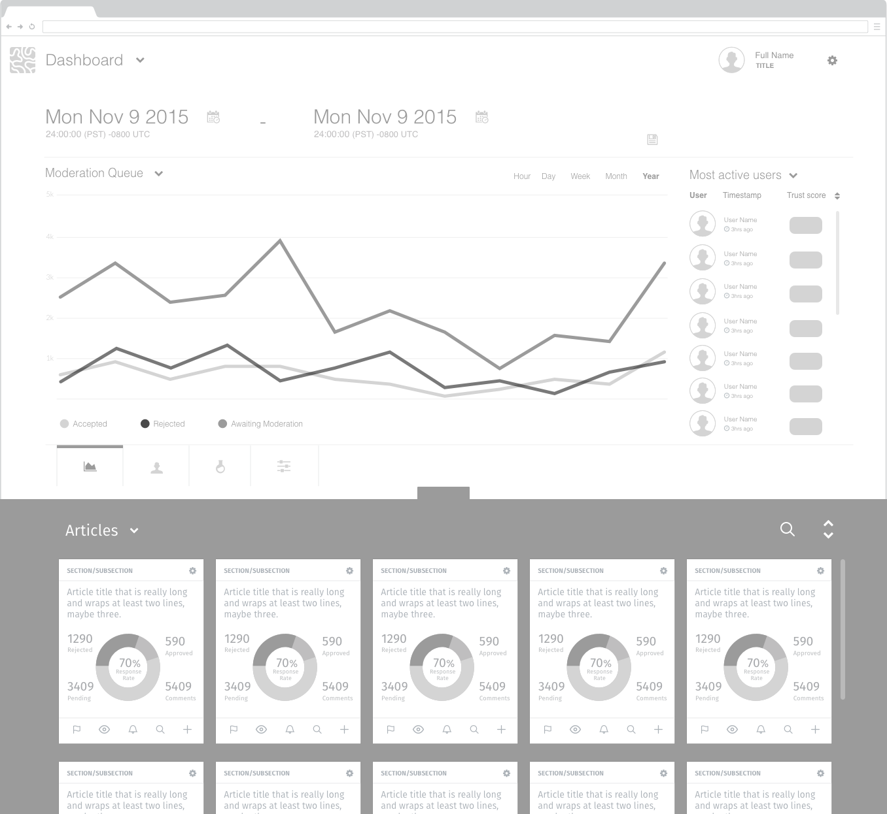
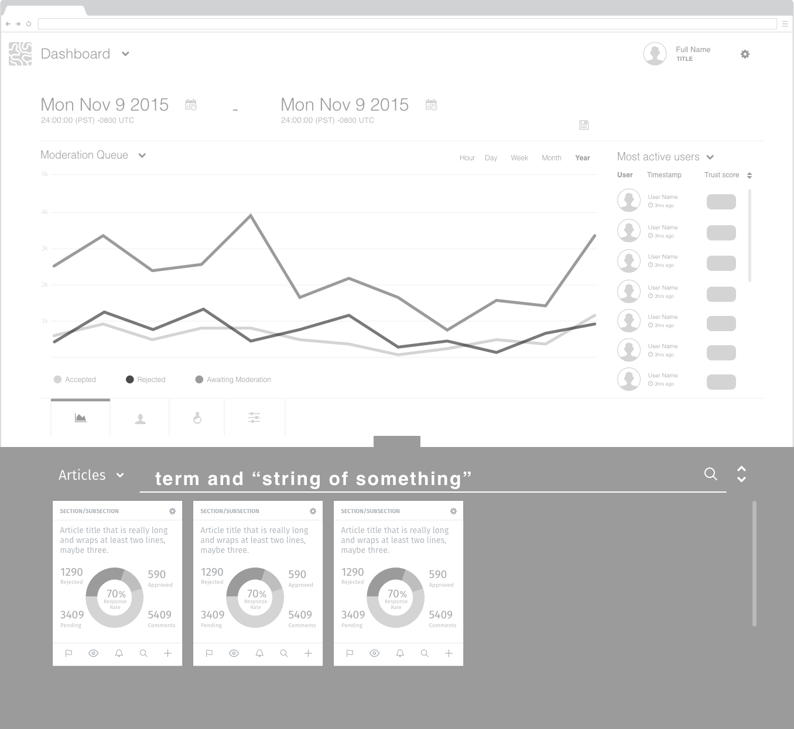
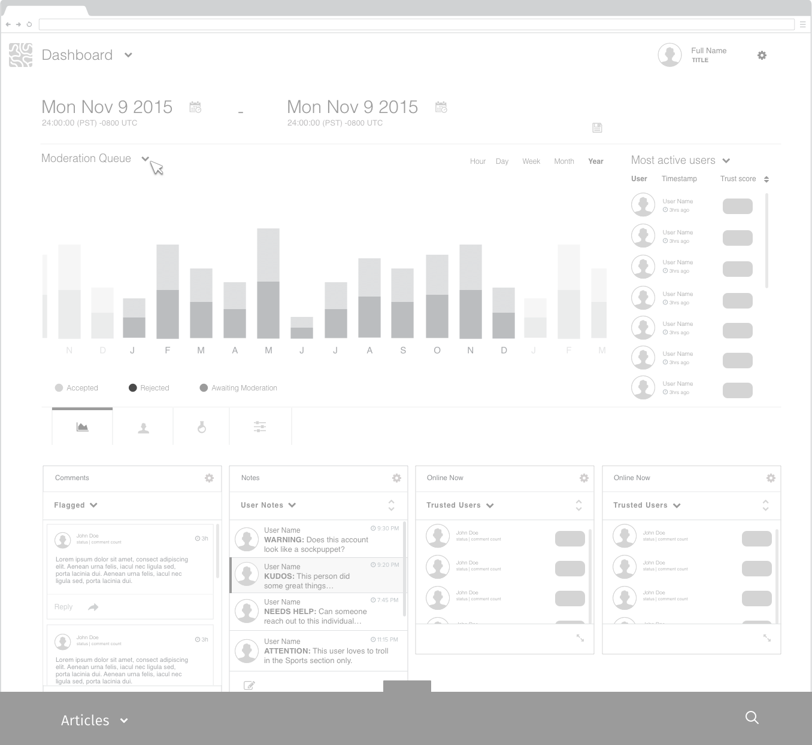
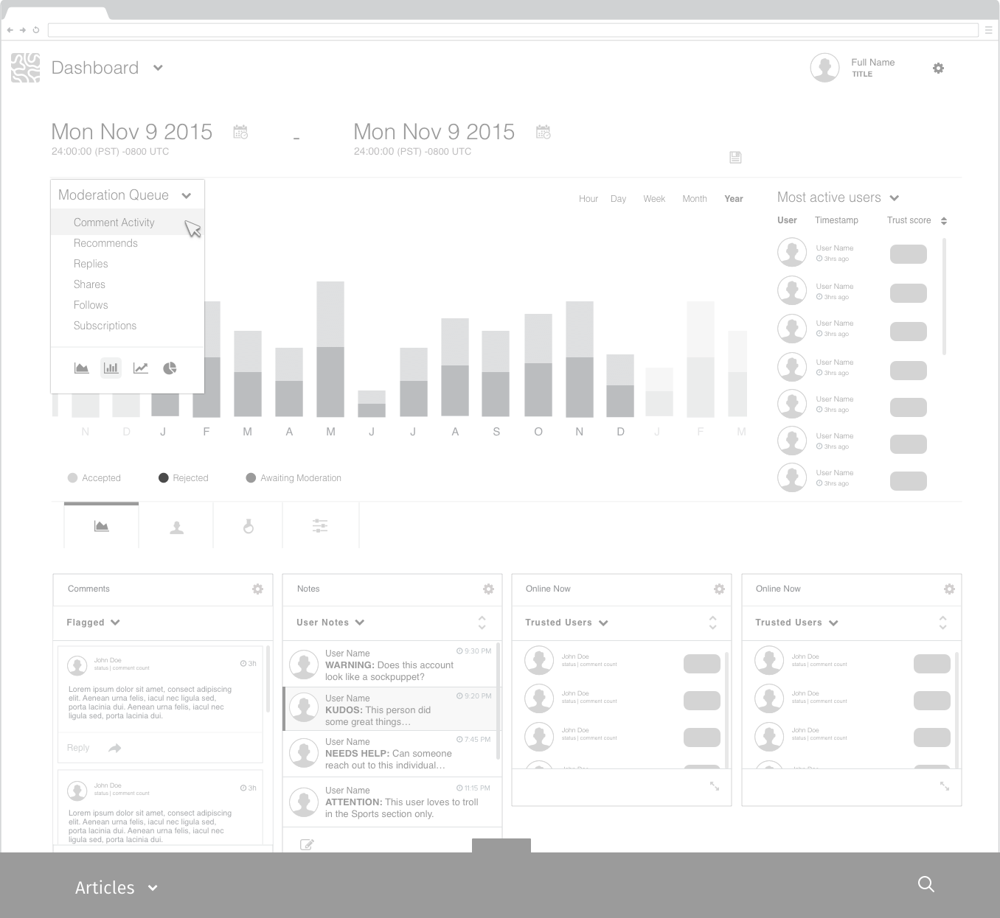
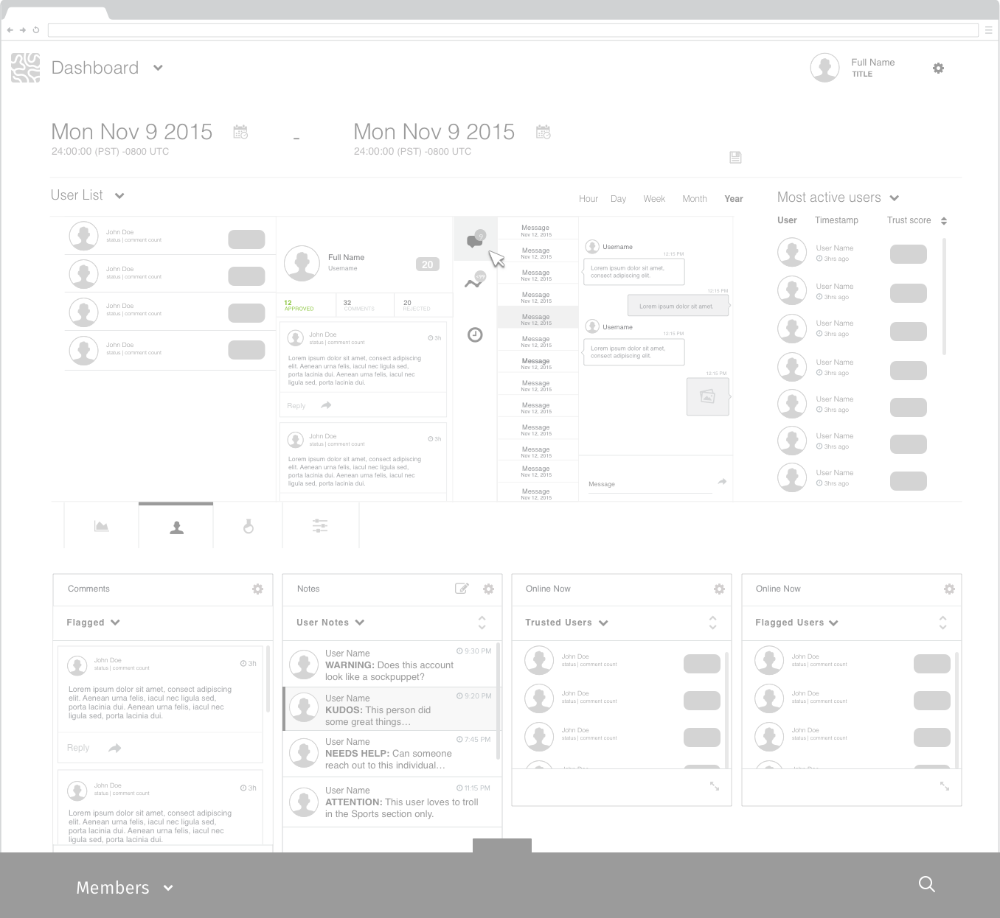
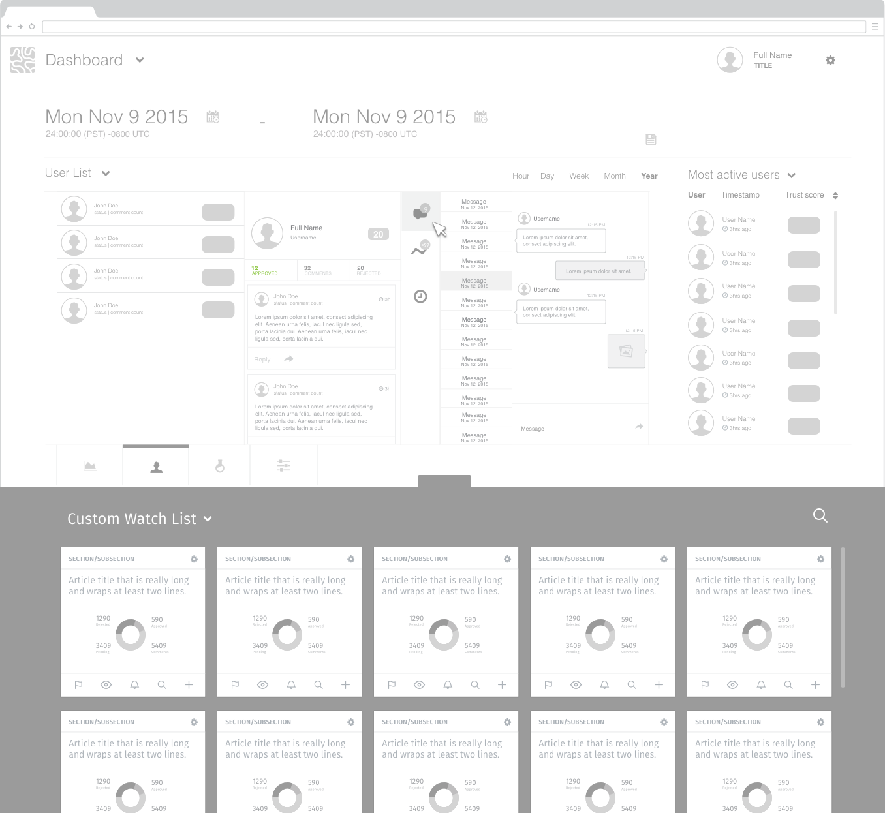
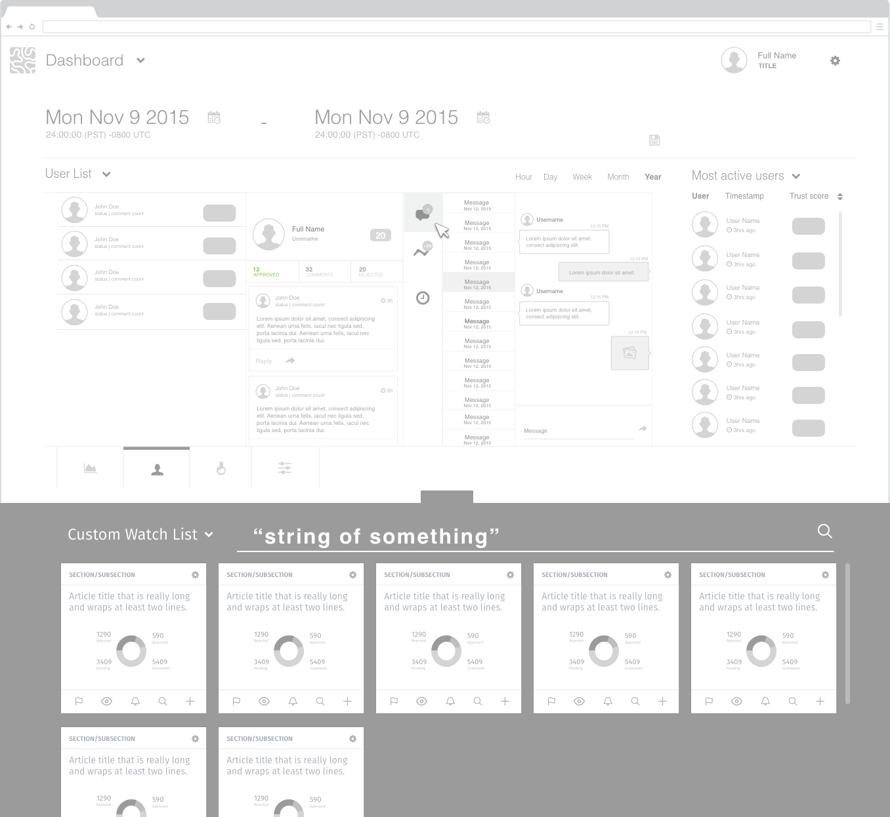
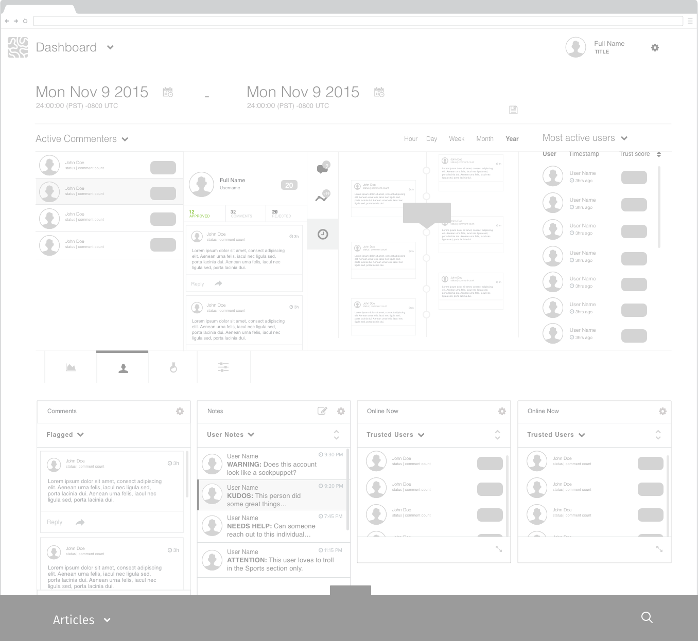

## 1.3.0

### Wireframes

#### Dashboard

 1. Dashboard

 

 2. Open panel containing data and lists filtered by content type and sorted chronologically.

 

 3. Search icon exposes search field. Full text search results across content types.

 

 4. Changing the data facet and graph can be done by going to the dropdown on the facet name or carat beside it.

 

 5. Select a different source and switch graphs.

 

 6. The User Manager tab displays a drill down layout to explore and interact with users across preset and custom groupings.

 

 7. The panel provides a quick view and search utility across different content and data sources.

 

 7. Searching for string matches on user profiles to find insights.

 

 8. Various engagement and collaboration tools in the vertical sub tab include messaging, activity timeline and analytics.

 

#### Dashboard - List driven UI concept mockup

 1. panel open

 

 2. panel closed

 

### Flows

Sign in

Engagement Editor Task 1

Engagement Editor Task 2

Engagement Editor Task 3

