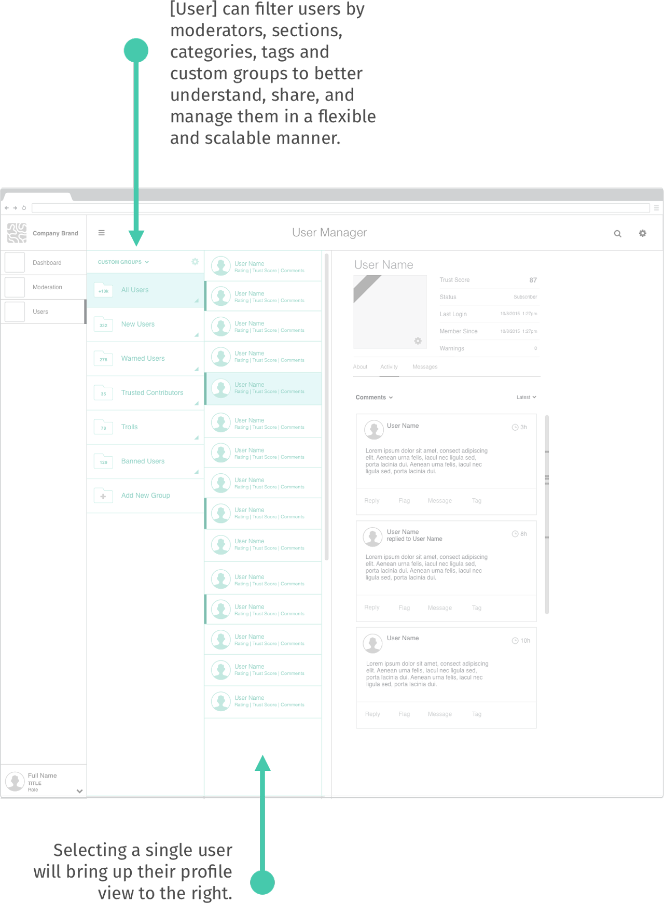
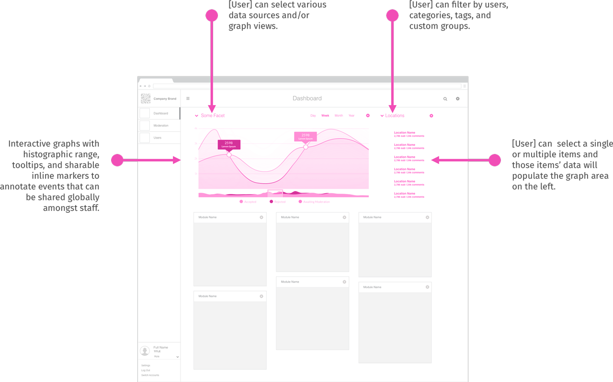
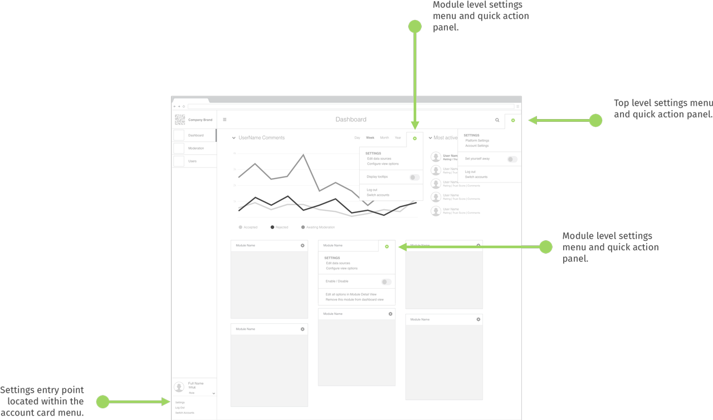

## Core Product
> "Our first product is a reputation analytics tool that takes existing comment log data to give indicative reputation scores to publishers.That information can then be used by publishers to i) identify their best commenters so their contributions can be highlighted and become the basis for future journalism based on their own definition of “good”, ii) give moderators a sense of context about each commenter, and iii) help publishers understand the nature of commenter behavior on their site."   
>Greg Barber [Our First Product](https://coralproject.net/first-product/)   

#### IA
IA Flow based on high level needs of Engagement Editor role.    

#### User Stories & Wireframes
*As an Engagement Editor*
-  I need analytics to be able to track people on site, retention, etc in order to calculate lifetime value of each reader. This is because it helps with the business calculations / advertising / proving and quantifying the value of community.

    

-  I need to have a sense of who is in a particular section's community so the publication can do a better job of identifying gaps in their coverage in order to serve the community better.

    

-  I need to have tools to pass on knowledge about active trolls, top commenters, etc within the system. This is so that user behavior can be understood in context, and institutional knowledge isn't lost if someone leaves.

    

-  I need a demographic/other data point breakdown to understand if good/bad behavior correlates to anything - eg time of day, language used, etc. to help allocate future moderation resources.

    

-  I need a way to configure, customize and extend each tool.    

    
