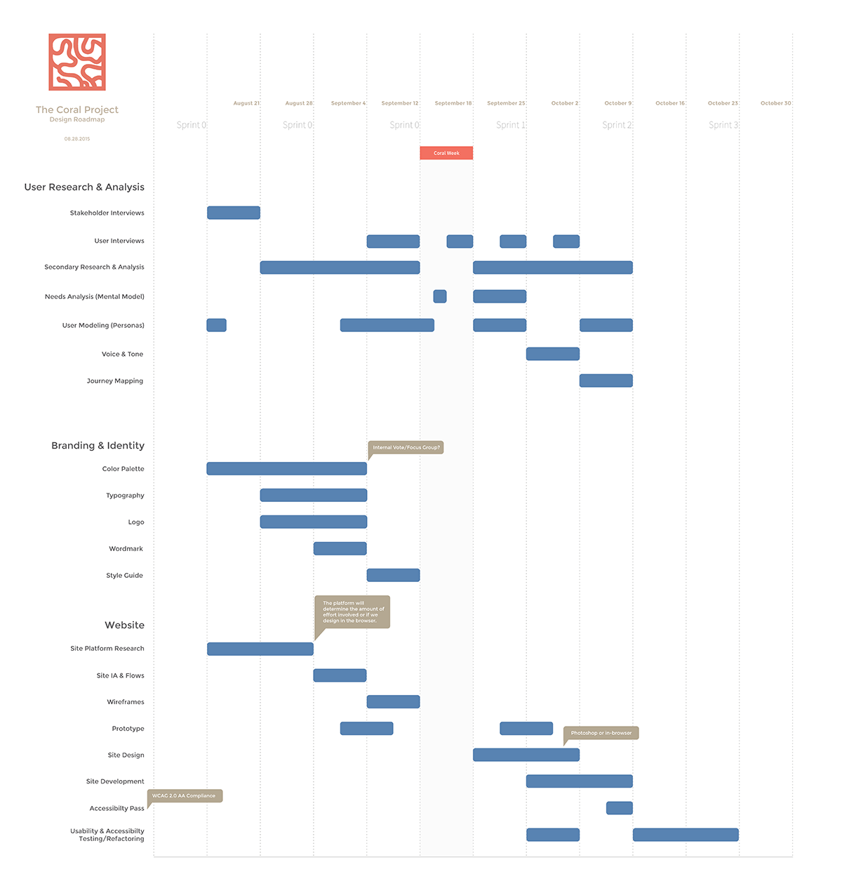

### Project Roadmap
Project roadmap for initial phase of project.

#### Project Success

1. Users' distinct concerns are met with a personalized value proposition which is attractive and engaging.
2. The platform is simple to understand and pleasing to use.
3. The platform accurately meets the goals of the users.

#### Project Failure

1. Users have not had their needs properly identified nor met.
2. The platform is unintuitive, cumbersome, and adds complexity or frustration to their workflow.
3. The platform fails to meet the goals of the users.
